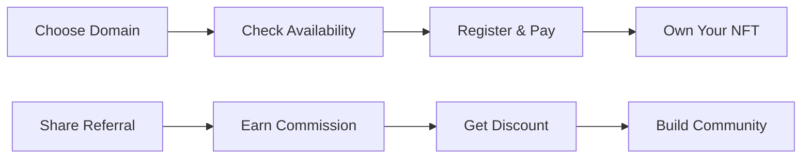

# InfinityName 🌐

---

## 🌟 What is InfinityName?

InfinityName is a revolutionary **multi-chain decentralized domain name system** that transforms how we think about digital identity across multiple blockchain networks. Unlike traditional domain systems, InfinityName domains are:

- **🎨 NFTs**: Each domain is a unique, tradeable NFT
- **🌐 Multi-Chain**: Available on 8+ different networks
- **💰 Profitable**: Earn 12.5% commission by referring others
- **🔒 Secure**: Built on battle-tested OpenZeppelin standards
- **🚀 Upgradeable**: Future-proof with UUPS upgrade pattern
- **⚡ Fast**: Instant registration and availability checking

### 🎯 The Vision

Imagine a world where your digital identity is truly yours - not controlled by centralized authorities, but secured by blockchain technology. InfinityName makes this vision reality by allowing you to:

- **Own Your Identity**: Register `yourname.blue`, `yourname.cd`, `yourname.gbob` and more across networks
- **Build Your Brand**: Create memorable domains for your projects on any supported network
- **Earn While Sharing**: Get paid for referring others to the platform
- **Trade Freely**: Buy, sell, and transfer domains on any NFT marketplace

---

## ✨ Key Features

### 🔐 **Domain Registration**
- **Multi-Chain Domains**: Register domains across 8+ supported networks
- **Network-Specific Extensions**: 
  - `.blue` on Base Network
  - `.cd` on Soneium Network  
  - `.gbob` on Bob Network
  - `.arise` on Rise Testnet
  - `.gmink` on Ink Network
  - `.unicorn` on Unichain Network
  - `.up` on Giwa Testnet
  - `.sup` on Optimism Network
- **Comprehensive Validation**: Length, character, and format checks
- **Availability Checking**: Real-time domain availability verification across all networks
- **NFT Ownership**: Your domain becomes a tradeable ERC-721 NFT
- **Gas Optimized**: Efficient storage patterns for minimal transaction costs

### 💰 **Revolutionary Referral System**
- **Dual Benefits**: 
  - 🎁 **12.5% Discount** for buyers using referrals
  - 💸 **12.5% Commission** for successful referrers
- **Hybrid Payment Technology**:
  - ⚡ **99% Users**: Instant automatic payments
  - 🛡️ **1% Users**: Secure pull-payment fallback for complex contracts
- **Reentrancy Protection**: 2300 gas limit prevents malicious interactions

### 🎯 **Primary Domain Management**
- **Set Primary**: Choose your main domain for easy identification
- **Automatic Reset**: Smart management when transferring domains
- **Quick Lookup**: Efficient primary domain queries across platforms
- **Cross-Platform**: Works seamlessly with any Web3 application

### 🔄 **Future-Proof Architecture**
- **UUPS Upgradeable**: Universal Upgradeable Proxy Standard
- **Storage Preservation**: Maintains all data across upgrades
- **Owner Controlled**: Only contract owner can authorize upgrades
- **Backward Compatible**: Seamless evolution without breaking changes

### 🛡️ **Enterprise-Grade Security**
- **Multi-Layer Protection**: Reentrancy guards, access controls, input validation
- **Battle-Tested**: Built on OpenZeppelin's proven security standards
- **Pausable Operations**: Emergency stop functionality for critical situations
- **Pull Payments**: Secure handling of failed transfers
- **Hash Collision Prevention**: Cryptographically secure domain hashing

---

## 🌐 Supported Networks

InfinityName operates across multiple blockchain networks, each with its own unique domain extension:

| Network | Extension | Status | Gas Cost |
|---------|-----------|--------|----------|
| **Base** | `.blue` | ✅ Live | Low |
| **Soneium** | `.cd` | ✅ Live | Low |
| **Bob** | `.gbob` | ✅ Live | Low |
| **Rise Testnet** | `.arise` | 🧪 Testnet | Low |
| **Ink** | `.gmink` | ✅ Live | Low |
| **Unichain** | `.unicorn` | ✅ Live | Low |
| **Giwa Testnet** | `.up` | 🧪 Testnet | Low |
| **Optimism** | `.sup` | ✅ Live | Low |

### 🔄 Cross-Chain Benefits
- **Multi-Network Identity**: Same domain across different networks
- **Network-Specific Features**: Optimized for each blockchain's capabilities
- **Flexible Pricing**: Different gas costs per network
- **Unified Experience**: Consistent interface across all networks

---

## 🚀 How It Works

### 📋 **Simple 4-Step Process**

### 🔍 **Domain Registration Flow**

1. **🔍 Check Availability**: Verify your desired domain is available
2. **💰 Calculate Price**: See exact cost with referral discounts
3. **📝 Register**: Complete registration in one transaction
4. **🎉 Own Your Domain**: Receive NFT and set as primary if desired

### 💸 **Referral Reward System**

1. **📤 Share Your Domain**: Share your `.up` domain with others
2. **🎁 They Get Discount**: Referred users pay 12.5% less
3. **💸 You Earn Commission**: Receive 12.5% of their registration fee
4. **🔄 Build Network**: Grow your referral network and earnings

---

## 💡 Real-World Use Cases

### 👤 **Personal Branding**
- **Multi-Chain Identity**: `yourname.blue`, `yourname.cd`, `yourname.gbob` across networks
- **Social Media**: Consistent identity across all platforms
- **Professional**: `johnsmith.sup` for business communications on Optimism
- **Memorable**: Easy-to-remember domains for sharing

### 🏢 **Business Applications**
- **Company Domains**: `company.blue` on Base, `company.sup` on Optimism
- **Product Names**: `product.gbob` for DeFi products, `product.gmink` for privacy-focused apps
- **Marketing**: Short, memorable domains for campaigns across networks
- **Brand Protection**: Secure your brand names early on multiple networks

### 💰 **Investment Opportunities**
- **Early Adoption**: Register valuable domains before they're taken across all networks
- **Multi-Chain Trading**: Buy and sell domains on NFT marketplaces across networks
- **Network-Specific Speculation**: Invest in domains optimized for specific blockchain features
- **Portfolio Diversification**: Build domains across different networks for risk distribution

### 🤝 **Community Building**
- **Cross-Chain Referral Networks**: Build income through referrals across all networks
- **Network-Specific Communities**: Create domains for communities on specific blockchains
- **Event Domains**: Special domains for events or projects on different networks
- **Collaboration**: Shared domains for team projects across multiple chains

---

## 🛡️ Security & Trust

### 🔒 **Multi-Layer Security Architecture**

| Security Layer | Protection | Implementation |
|----------------|-----------|----------------|
| **Reentrancy Guards** | Prevents reentrancy attacks | `nonReentrant` modifier on all critical functions |
| **Access Control** | Owner-only administrative functions | `onlyOwner` modifier with proper authorization |
| **Input Validation** | Prevents malicious inputs | Comprehensive domain format validation |
| **Hash Collision Prevention** | Secure domain hashing | `abi.encode()` instead of `abi.encodePacked()` |
| **Pull Payment System** | Secure failed transfer handling | Fallback mechanism for complex contracts |
| **Pausable Operations** | Emergency stop capability | `pause()`/`unpause()` for critical situations |

### 🏆 **Audit & Verification**

- ✅ **OpenZeppelin Standards**: Built on industry-proven security patterns
- ✅ **UUPS Upgrade Pattern**: Secure upgrade mechanism
- ✅ **Comprehensive Testing**: Extensive test coverage for all scenarios
- ✅ **Gas Optimization**: Efficient code for minimal transaction costs
- ✅ **Event Logging**: Complete audit trail for all operations

### 🛠️ **Technical Specifications**

- **Contract Standard**: ERC-721 Upgradeable
- **Upgrade Pattern**: UUPS (Universal Upgradeable Proxy Standard)
- **Security Framework**: OpenZeppelin Contracts
- **Solidity Version**: ^0.8.20
- **License**: MIT (Open Source)

---

### 🛠️ **Developer Resources**
- **Smart Contract**: Fully audited and upgradeable
- **API Documentation**: Complete integration guide
- **SDK Support**: JavaScript/TypeScript libraries
- **Community Tools**: Open-source utilities and helpers

---

## 💰 Pricing & Economics

### 💵 **Registration Costs**
- **Standard Price**: 0.00032 ETH
- **With Referral**: 12.5% discount
- **Gas Fees**: Additional network transaction costs
- **No Hidden Fees**: Transparent pricing structure

### 💸 **Referral Economics**
- **Commission Rate**: 12.5% of registration fee
- **Payment Method**: Hybrid instant/pull-payment system
- **Minimum Payout**: No minimum threshold
- **Payment Frequency**: Instant for 99% of users

### 📊 **ROI Potential**
- **Referral Income**: Earn 12.5% ETH per successful referral
- **Network Effect**: Exponential growth potential
- **Passive Income**: Earn while you sleep
- **Scalable**: No limit on referral earnings

---

## 🚀 Getting Started

### 🎯 **For Domain Owners**

1. **Connect Wallet**: Link your Ethereum wallet
2. **Choose Domain**: Search for available `.up .blue .sup` domains
3. **Register**: Complete registration with ETH payment
4. **Set Primary**: Choose your main domain identity
5. **Start Referring**: Share your domain to earn commissions

### 💼 **For Businesses**

1. **Brand Protection**: Register your company domains early
2. **Team Domains**: Create domains for team members
3. **Product Launch**: Secure domains for new products
4. **Marketing Campaigns**: Use memorable domains for campaigns

### 💰 **For Investors**

1. **Research**: Identify potentially valuable domains
2. **Register**: Secure domains before others
3. **Trade**: Buy and sell on NFT marketplaces
4. **Referral Network**: Build passive income streams

---

## 🌍 Community & Support

### 💬 **Join Our Community**
- **Discord**: [Join our Discord server](https://discord.gg/) for real-time support
- **Twitter**: [Follow @Infinitynamecom](https://twitter.com/Infinitynamecom) for updates
- **Telegram**: [Join our Telegram group](https://t.me/) for discussions
- **GitHub**: [Contribute to our codebase](https://github.com/infinitynamecom)

### 🆘 **Support Channels**
- **Technical Support**: Available 24/7 on Discord
- **Bug Reports**: Submit issues on GitHub
- **Feature Requests**: Community-driven development
- **Partnership Inquiries**: Contact us for business partnerships

---

## 🔮 Roadmap & Future

### 🎯 **Upcoming Features**
- **Additional Networks**: Expand to Polygon, BSC, Arbitrum, and more

### 🚀 **Long-Term Vision**
- **Global Adoption**: Become the standard for decentralized domains across all networks
- **Ecosystem Growth**: Build comprehensive Web3 identity platform spanning multiple blockchains
- **Universal Cross-Chain**: Seamless domain management across all supported blockchains
- **Enterprise Solutions**: Business-grade domain management tools for all network types

---

### 🌐 **Start Your Journey Today**

