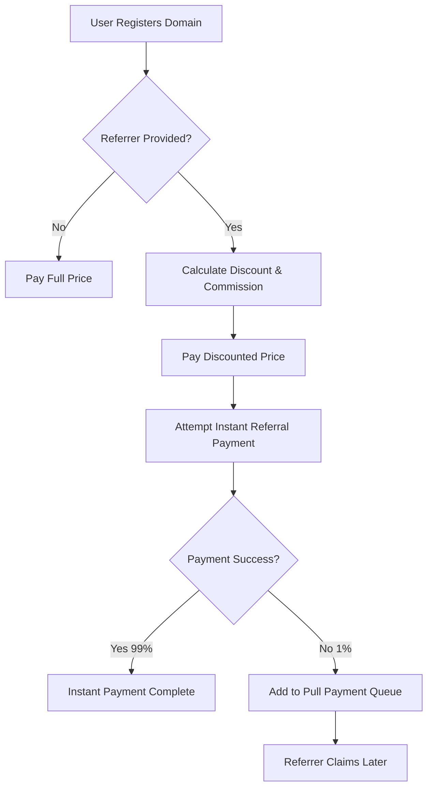

# InfinityNameUpgradeable

[](https://opensource.org/licenses/MIT)
[](https://soliditylang.org/)
[](https://openzeppelin.com/)

A secure, upgradeable ERC-721 smart contract for decentralized domain name registration with built-in referral rewards and hybrid payment mechanisms.

## 🚀 Quick Start

```solidity
// Register a domain with referral
infinityName.register{value: 0.00021 ether}("mydomain", referrerAddress);

// Set primary domain
infinityName.setPrimaryDomain(tokenId);

// Check domain availability
bool available = infinityName.isAvailable("mydomain");
```

## 📋 Table of Contents

- [Overview](#overview)
- [Features](#features)
- [Architecture](#architecture)
- [Installation & Setup](#installation--setup)
- [Deployment & Upgrades](#deployment--upgrades)
- [API Reference](#api-reference)
- [Referral System](#referral-system)
- [Security](#security)
- [Events](#events)
- [Error Handling](#error-handling)
- [Testing](#testing)
- [License](#license)

---

## Overview

InfinityNameUpgradeable is a UUPS-upgradeable ERC-721 smart contract that enables decentralized domain name registration with a `.up` suffix. The contract features:

- **Secure Domain Registration**: Root domain minting with comprehensive validation
- **Referral Rewards**: 12.5% discount for buyers, 12.5% commission for referrers
- **Hybrid Payment System**: Instant payments for 99% of users, pull-payment fallback for complex contracts
- **Primary Domain Management**: Set and track primary domains per address
- **Upgradeable Architecture**: UUPS pattern for seamless contract evolution
- **On-chain SVG Generation**: Dynamic NFT metadata with embedded SVG graphics

### Core Technologies

- **OpenZeppelin Upgradeable**: Battle-tested upgradeable contracts
- **UUPS Upgrade Pattern**: Universal Upgradeable Proxy Standard
- **ERC-721**: Non-fungible token standard for domain ownership
- **Security Features**: Ownable, Pausable, ReentrancyGuard

---

## Features

### 🔐 Domain Registration
- **Root Domain Minting**: Register domains with `.up` suffix
- **Comprehensive Validation**: Length, character, and format checks
- **Availability Checking**: Real-time domain availability verification
- **Gas-Optimized**: Efficient storage patterns and minimal external calls

### 💰 Referral System
- **Dual Benefits**: 12.5% discount for buyers, 12.5% commission for referrers
- **Hybrid Payments**: 
  - **99% Users**: Instant automatic payments (2300 gas limit for security)
  - **1% Users**: Pull-payment fallback for complex smart contracts
- **Reentrancy Protection**: Limited gas prevents malicious contract interactions

### 🎯 Primary Domain Management
- **Primary Assignment**: Set any owned domain as primary
- **Automatic Reset**: Primary domain resets on transfer
- **Quick Lookup**: Efficient primary domain queries per address

### 🔄 Upgradeability
- **UUPS Pattern**: Universal Upgradeable Proxy Standard
- **Storage Preservation**: Maintains state across upgrades
- **Owner-Controlled**: Only contract owner can authorize upgrades

### 🛡️ Security Features
- **Pausable Operations**: Emergency pause/unpause functionality
- **Pull Payments**: Secure handling of failed transfers
- **Access Control**: Owner-only administrative functions
- **Reentrancy Guards**: Protection against reentrancy attacks

---

## Architecture

### Storage Structure

```solidity
// Core mappings
mapping(bytes32 => uint256) public domainToToken;  // hash(domain + suffix) => tokenId
mapping(uint256 => string) public tokenToDomain;   // tokenId => fullDomain
mapping(address => uint256[]) private ownerTokens; // owner => tokenIds[]
mapping(address => uint256) public primaryDomain;  // owner => primaryTokenId

// Payment systems
mapping(address => uint256) public pendingWithdrawals;   // feeRecipient fallback
mapping(address => uint256) public referralWithdrawals;  // referrer fallback
```

### Domain Resolution

| Component | Description | Example |
|-----------|-------------|---------|
| **Domain Input** | User-provided domain name | `"mydomain"` |
| **Suffix** | Contract-configured suffix | `".up"` |
| **Full Domain** | Complete domain name | `"mydomain.up"` |
| **Domain Hash** | `keccak256(abi.encode(domain, suffix))` | `0x1234...` |
| **Token ID** | Unique NFT identifier | `1, 2, 3...` |

### Fee Structure

| Fee Type | Percentage | Recipient | Description |
|----------|------------|-----------|-------------|
| **Registration Fee** | Variable | `feeRecipient` | Main contract revenue |
| **Referral Discount** | 12.5% | Buyer | Discounted price for referred users |
| **Referral Commission** | 12.5% | Referrer | Commission for successful referrals |

---

## Installation & Setup

### Prerequisites

- Node.js LTS (v18+)
- npm/yarn/pnpm package manager
- EVM network access (Anvil, Hardhat Node, Sepolia, Mainnet)

### Dependencies

```bash
# Core OpenZeppelin packages
npm install @openzeppelin/contracts-upgradeable @openzeppelin/contracts

# Development tools (optional)
npm install --save-dev hardhat @nomicfoundation/hardhat-toolbox
npm install --save-dev @openzeppelin/hardhat-upgrades
```

### Compilation

```bash
# Compile contracts
npx hardhat compile

# Run tests
npx hardhat test

# Deploy to network
npx hardhat run scripts/deploy.js --network sepolia
```

---

## Deployment & Upgrades

### Initial Deployment

The contract uses UUPS (Universal Upgradeable Proxy Standard) architecture. The constructor is disabled, and initialization occurs via `initialize()`.

#### Default Configuration

```solidity
function initialize() public initializer {
    __ERC721_init("InfinityName", "INAME");
    __Ownable_init(msg.sender);
    __ReentrancyGuard_init();
    __Pausable_init();
    __UUPSUpgradeable_init();

    price = 210000000000000; // 0.00021 ETH
    nextTokenId = 0;
    _suffix = ".up";
    feeRecipient = payable(0xf6547f77614F7dAf76e62767831d594b8a6e5e3b);
    
    emit ContractInitialized(price, feeRecipient, _suffix);
}
```

#### Deployment Script Example

```javascript
// scripts/deploy.js
const { ethers, upgrades } = require("hardhat");

async function main() {
  const InfinityNameUpgradeable = await ethers.getContractFactory("InfinityNameUpgradeable");
  
  const infinityName = await upgrades.deployProxy(
    InfinityNameUpgradeable,
    [], // No constructor arguments
    { initializer: "initialize" }
  );

  await infinityName.waitForDeployment();
  
  console.log("InfinityName deployed to:", await infinityName.getAddress());
}

main().catch((error) => {
  console.error(error);
  process.exitCode = 1;
});
```

### Contract Upgrades

```javascript
// scripts/upgrade.js
const { ethers, upgrades } = require("hardhat");

async function main() {
  const InfinityNameUpgradeableV2 = await ethers.getContractFactory("InfinityNameUpgradeableV2");
  
  const infinityName = await upgrades.upgradeProxy(
    "0x...", // Current proxy address
    InfinityNameUpgradeableV2
  );

  console.log("Contract upgraded successfully");
}

main().catch((error) => {
  console.error(error);
  process.exitCode = 1;
});
```

### Important Notes

- ⚠️ **Storage Layout**: Never modify variable order or remove `__gap` storage
- 🔒 **Upgrade Authorization**: Only contract owner can authorize upgrades
- 🎯 **Single Initialization**: `initialize()` can only be called once
- 📝 **Event Emission**: All state changes emit appropriate events

---

## API Reference

### Domain Registration

#### `register(string domain, address referrer)`

Registers a new domain with optional referral benefits.

**Parameters:**
- `domain` (string): Domain name to register (1-63 characters, a-z0-9-)
- `referrer` (address): Referrer address for discount/commission (cannot be msg.sender)

**Requirements:**
- `msg.value >= actualPrice` (price minus referral discount)
- `isValidDomain(domain) == true`
- Domain must not already be registered
- Contract must not be paused

**Events Emitted:**
- `DomainRegistered(owner, domain, tokenId)`
- `ReferralPaid(referrer, amount, buyer)` (if referrer provided)
- `ReferralDiscountApplied(buyer, discountAmount, referrer)` (if referrer provided)

**Example:**
```solidity
// Register without referral
infinityName.register{value: 0.00021 ether}("mydomain", address(0));

// Register with referral (12.5% discount)
infinityName.register{value: 0.00018375 ether}("mydomain", referrerAddress);
```

### Primary Domain Management

#### `setPrimaryDomain(uint256 tokenId)`

Sets a token as the caller's primary domain.

**Parameters:**
- `tokenId` (uint256): Token ID to set as primary

**Requirements:**
- Caller must own the token
- Token must exist

**Events Emitted:**
- `PrimaryDomainSet(owner, tokenId, domain)`

#### `getPrimaryDomain(address owner)`

Returns the primary domain for an address.

**Parameters:**
- `owner` (address): Address to query

**Returns:**
- `string`: Primary domain name (empty string if none set)

### Domain Validation & Queries

#### `isValidDomain(string domain)`

Validates domain name format and constraints.

**Parameters:**
- `domain` (string): Domain to validate

**Returns:**
- `bool`: True if domain is valid

**Validation Rules:**
- Length: 1-63 characters
- Characters: a-z, 0-9, hyphen (-)
- Cannot start or end with hyphen
- No consecutive hyphens

#### `isAvailable(string domain)`

Checks if a domain is available for registration.

**Parameters:**
- `domain` (string): Domain to check

**Returns:**
- `bool`: True if domain is available

### View Functions

#### `getDomainsOf(address owner)`

Returns all domains owned by an address.

**Parameters:**
- `owner` (address): Address to query

**Returns:**
- `string[]`: Array of domain names

#### `getTokenIdsOf(address owner)`

Returns all token IDs owned by an address.

**Parameters:**
- `owner` (address): Address to query

**Returns:**
- `uint256[]`: Array of token IDs

#### `tokenURI(uint256 tokenId)`

Returns the token URI with embedded SVG metadata.

**Parameters:**
- `tokenId` (uint256): Token ID

**Returns:**
- `string`: Base64-encoded JSON metadata with SVG

#### `getStats()`

Returns contract statistics.

**Returns:**
- `totalSupply` (uint256): Total number of registered domains
- `registrationPrice` (uint256): Current registration price in wei
- `domainSuffix` (string): Contract domain suffix (".up")

### Referral System Functions

#### `getPriceWithReferral(address referrer)`

Calculates the discounted price with referral.

**Parameters:**
- `referrer` (address): Referrer address

**Returns:**
- `uint256`: Discounted price (or full price if no valid referrer)

#### `getReferralDiscount()`

Returns the referral discount percentage.

**Returns:**
- `uint256`: Discount percentage (1250 = 12.5%)

#### `getReferralCommission()`

Returns the referral commission percentage.

**Returns:**
- `uint256`: Commission percentage (1250 = 12.5%)

#### `claimReferralReward()`

Claims pending referral rewards (pull-payment fallback).

**Requirements:**
- Caller must have pending referral rewards
- Contract must not be paused

**Events Emitted:**
- `ReferralWithdrawal(referrer, amount)`

#### `getReferralWithdrawal(address referrer)`

Returns pending referral withdrawal amount.

**Parameters:**
- `referrer` (address): Referrer address

**Returns:**
- `uint256`: Pending withdrawal amount

### Administrative Functions

#### `setPrice(uint256 newPrice)`

Updates the registration price (owner only).

**Parameters:**
- `newPrice` (uint256): New price in wei

**Events Emitted:**
- `PriceUpdated(oldPrice, newPrice)`

#### `setFeeRecipient(address payable newRecipient)`

Updates the fee recipient address (owner only).

**Parameters:**
- `newRecipient` (address): New fee recipient address

**Events Emitted:**
- `FeeRecipientUpdated(oldRecipient, newRecipient)`

#### `pause()` / `unpause()`

Pauses or unpauses contract operations (owner only).

**Events Emitted:**
- `Paused(account)` / `Unpaused(account)`

#### `withdraw()`

Emergency withdrawal of contract balance (owner only).

**Events Emitted:**
- `EmergencyWithdrawal(owner, amount)`

#### `emergencyTransfer(uint256 tokenId, address to)`

Emergency transfer of any token (owner only).

**Parameters:**
- `tokenId` (uint256): Token to transfer
- `to` (address): Recipient address

**Events Emitted:**
- `TokenSeized(from, to, tokenId)`

### Pull Payment System

#### `withdrawPendingPayments()`

Withdraws pending payments (feeRecipient only).

**Requirements:**
- Caller must be feeRecipient
- Must have pending withdrawals

**Events Emitted:**
- `WithdrawalClaimed(account, amount)`

#### `getPendingWithdrawal(address account)`

Returns pending withdrawal amount for feeRecipient.

**Parameters:**
- `account` (address): Account to query

**Returns:**
- `uint256`: Pending amount (0 for non-feeRecipient addresses)

---

## Referral System

The InfinityName referral system provides benefits to both referrers and referred users through a hybrid payment mechanism designed for security and user experience.

### How It Works

#### For Referred Users (Buyers)
- **12.5% Discount**: Pay less for domain registration
- **Automatic Application**: Discount applied during registration
- **No Additional Steps**: Seamless registration experience

#### For Referrers
- **12.5% Commission**: Earn from successful referrals
- **Hybrid Payment**: Instant payment for most users, pull-payment fallback for complex contracts
- **Secure Mechanism**: 2300 gas limit prevents reentrancy attacks

### Payment Flow



### Security Features

#### Reentrancy Protection
- **2300 Gas Limit**: Prevents malicious contract interactions
- **Pull Payment Fallback**: Secure alternative for complex contracts
- **NonReentrant Modifier**: Additional protection on critical functions

#### Attack Prevention
- **Self-Referral Blocking**: Users cannot refer themselves
- **Early Validation**: Referrer check happens before payment
- **State Consistency**: All state changes follow Checks-Effects-Interactions pattern

### Usage Examples

```solidity
// Calculate discounted price
uint256 discountedPrice = infinityName.getPriceWithReferral(referrerAddress);

// Register with referral
infinityName.register{value: discountedPrice}("mydomain", referrerAddress);

// Check pending referral rewards
uint256 pendingRewards = infinityName.getReferralWithdrawal(referrerAddress);

// Claim referral rewards (if instant payment failed)
infinityName.claimReferralReward();
```

---

## Security

InfinityNameUpgradeable implements multiple layers of security to protect against common smart contract vulnerabilities.

### Reentrancy Protection

#### Multi-Layer Defense
1. **NonReentrant Modifier**: Applied to all critical functions
2. **Checks-Effects-Interactions Pattern**: Proper execution order
3. **Limited Gas Payments**: 2300 gas limit for referral payments
4. **Pull Payment Fallback**: Secure alternative for complex contracts

#### Implementation Details
```solidity
// Checks: Validate inputs and state
if (referrer == msg.sender) revert InvalidReferrer();
if (msg.value < actualPrice) revert InsufficientPayment();

// Effects: Update state
domainToToken[domainHash] = tokenId;
tokenToDomain[tokenId] = fullDomain;

// Interactions: External calls last
(bool success, ) = referrer.call{value: referralFee, gas: 2300}("");
```

### Hash Collision Prevention

#### Secure Hashing
- **abi.encode()**: Prevents hash collisions from string concatenation
- **Domain Separation**: Suffix included in hash calculation
- **Collision Resistance**: Cryptographically secure hash function

```solidity
function _domainHash(string memory domain) internal view returns (bytes32) {
    return keccak256(abi.encode(domain, _suffix));
}
```

### Access Control

#### Owner-Only Functions
- **Price Management**: `setPrice()`
- **Fee Recipient**: `setFeeRecipient()`
- **Emergency Controls**: `pause()`, `unpause()`, `withdraw()`
- **Upgrade Authorization**: `_authorizeUpgrade()`

#### User Permissions
- **Token Ownership**: Required for transfers and primary domain setting
- **Fee Recipient**: Can withdraw pending payments
- **Referrer**: Can claim referral rewards

### Front-Running Mitigation

#### Known Risk
Domain registration is vulnerable to front-running attacks, which is inherent to all public blockchain domain systems.

#### Mitigation Strategies
1. **Private Transaction Pools**: Use Flashbots or similar services
2. **Commit-Reveal Scheme**: Future implementation planned
3. **Higher Gas Prices**: Increase transaction priority
4. **MEV Protection**: Consider MEV protection services

### Additional Security Features

#### Operational Controls
- **Pausable Contract**: Emergency stop functionality
- **Pull Payments**: Secure handling of failed transfers
- **Event Logging**: Comprehensive audit trail
- **Input Validation**: Strict domain format requirements

#### Upgrade Safety
- **UUPS Pattern**: Secure upgrade mechanism
- **Storage Preservation**: State maintained across upgrades
- **Owner Authorization**: Only owner can authorize upgrades

---

## Events

InfinityNameUpgradeable emits comprehensive events for transparency and off-chain integration.

### Domain Events

| Event | Parameters | Description |
|-------|------------|-------------|
| `DomainRegistered` | `owner`, `domain`, `tokenId` | Emitted when a domain is successfully registered |
| `PrimaryDomainSet` | `owner`, `tokenId`, `domain` | Emitted when a primary domain is set |
| `PrimaryDomainReset` | `owner`, `tokenId` | Emitted when primary domain is reset on transfer |

### Payment Events

| Event | Parameters | Description |
|-------|------------|-------------|
| `ReferralPaid` | `referrer`, `amount`, `buyer` | Emitted when referral commission is paid |
| `ReferralPendingWithdrawal` | `referrer`, `amount` | Emitted when referral payment fails and goes to pull system |
| `ReferralDiscountApplied` | `buyer`, `discountAmount`, `referrer` | Emitted when referral discount is applied |
| `ReferralWithdrawal` | `referrer`, `amount` | Emitted when referral rewards are claimed |
| `RegistrationFeeCollected` | `recipient`, `amount` | Emitted when registration fee is collected |
| `PendingWithdrawal` | `account`, `amount` | Emitted when payment fails and goes to pull system |
| `WithdrawalClaimed` | `account`, `amount` | Emitted when pending withdrawal is claimed |

### Administrative Events

| Event | Parameters | Description |
|-------|------------|-------------|
| `PriceUpdated` | `oldPrice`, `newPrice` | Emitted when registration price is updated |
| `FeeRecipientUpdated` | `oldRecipient`, `newRecipient` | Emitted when fee recipient is updated |
| `EmergencyWithdrawal` | `owner`, `amount` | Emitted during emergency withdrawal |
| `TokenSeized` | `from`, `to`, `tokenId` | Emitted during emergency token transfer |
| `ContractInitialized` | `price`, `feeRecipient`, `suffix` | Emitted during contract initialization |

### Event Monitoring Example

```javascript
// Listen for domain registrations
infinityName.on("DomainRegistered", (owner, domain, tokenId) => {
    console.log(`Domain ${domain} registered by ${owner} with token ID ${tokenId}`);
});

// Listen for referral payments
infinityName.on("ReferralPaid", (referrer, amount, buyer) => {
    console.log(`Referral payment: ${ethers.formatEther(amount)} ETH to ${referrer} for buyer ${buyer}`);
});
```

---

## Error Handling

InfinityNameUpgradeable uses custom errors for gas-efficient error handling and clear error messages.

### Custom Errors

| Error | Description | Trigger Conditions |
|-------|-------------|-------------------|
| `InsufficientPayment()` | Payment amount is less than required | `msg.value < actualPrice` |
| `DomainAlreadyRegistered()` | Domain is already registered | Domain hash exists in `domainToToken` |
| `InvalidDomain()` | Domain format is invalid | Fails `isValidDomain()` checks |
| `DomainNotFound()` | Token does not exist | Token ID not found in `tokenToDomain` |
| `TransferFailed()` | ETH transfer failed | External call returns false |
| `InvalidReferrer()` | Referrer is invalid | `referrer == msg.sender` |
| `NotTokenOwner()` | Caller does not own token | Token owner != msg.sender |

### Error Handling Best Practices

#### Frontend Integration
```javascript
try {
    await infinityName.register("mydomain", referrerAddress, {
        value: ethers.parseEther("0.00021")
    });
} catch (error) {
    if (error.message.includes("InsufficientPayment")) {
        console.log("Please send more ETH");
    } else if (error.message.includes("DomainAlreadyRegistered")) {
        console.log("Domain is already taken");
    } else if (error.message.includes("InvalidReferrer")) {
        console.log("Cannot refer yourself");
    }
}
```

#### Contract Integration
```solidity
try infinityName.register{value: price}("mydomain", referrer) {
    // Registration successful
} catch Error(string memory reason) {
    // Handle string errors
} catch (bytes memory lowLevelData) {
    // Handle custom errors
}
```

---

## Testing

Comprehensive testing ensures contract reliability and security. Here are recommended test scenarios:

### Domain Registration Tests

```javascript
describe("Domain Registration", () => {
    it("Should register domain successfully", async () => {
        await infinityName.register("testdomain", ZERO_ADDRESS, {
            value: ethers.parseEther("0.00021")
        });
        
        expect(await infinityName.isAvailable("testdomain")).to.be.false;
        expect(await infinityName.ownerOf(1)).to.equal(owner.address);
    });

    it("Should revert with insufficient payment", async () => {
        await expect(
            infinityName.register("testdomain", ZERO_ADDRESS, {
                value: ethers.parseEther("0.0001") // Too low
            })
        ).to.be.revertedWithCustomError(infinityName, "InsufficientPayment");
    });

    it("Should revert when domain already registered", async () => {
        await infinityName.register("testdomain", ZERO_ADDRESS, {
            value: ethers.parseEther("0.00021")
        });
        
        await expect(
            infinityName.register("testdomain", ZERO_ADDRESS, {
                value: ethers.parseEther("0.00021")
            })
        ).to.be.revertedWithCustomError(infinityName, "DomainAlreadyRegistered");
    });
});
```

### Referral System Tests

```javascript
describe("Referral System", () => {
    it("Should apply discount and pay commission", async () => {
        const discountedPrice = await infinityName.getPriceWithReferral(referrer.address);
        
        await infinityName.register("testdomain", referrer.address, {
            value: discountedPrice
        });
        
        // Check referrer received commission
        expect(await ethers.provider.getBalance(referrer.address)).to.be.gt(initialBalance);
    });

    it("Should revert when self-referring", async () => {
        await expect(
            infinityName.register("testdomain", owner.address, {
                value: ethers.parseEther("0.00021")
            })
        ).to.be.revertedWithCustomError(infinityName, "InvalidReferrer");
    });
});
```

### Security Tests

```javascript
describe("Security", () => {
    it("Should prevent reentrancy attacks", async () => {
        const maliciousContract = await deployMaliciousContract();
        
        await expect(
            infinityName.connect(maliciousContract).register("testdomain", maliciousContract.address, {
                value: ethers.parseEther("0.00021")
            })
        ).to.be.reverted; // Should fail due to gas limit
    });

    it("Should handle failed transfers gracefully", async () => {
        const failingContract = await deployFailingContract();
        
        await infinityName.register("testdomain", failingContract.address, {
            value: ethers.parseEther("0.00021")
        });
        
        // Check pull payment was created
        expect(await infinityName.getReferralWithdrawal(failingContract.address)).to.be.gt(0);
    });
});
```

### Upgrade Tests

```javascript
describe("Upgrades", () => {
    it("Should preserve state after upgrade", async () => {
        // Register domain before upgrade
        await infinityName.register("testdomain", ZERO_ADDRESS, {
            value: ethers.parseEther("0.00021")
        });
        
        // Upgrade contract
        const InfinityNameV2 = await ethers.getContractFactory("InfinityNameUpgradeableV2");
        await upgrades.upgradeProxy(infinityName.address, InfinityNameV2);
        
        // Verify state preserved
        expect(await infinityName.ownerOf(1)).to.equal(owner.address);
        expect(await infinityName.tokenToDomain(1)).to.equal("testdomain.up");
    });
});
```

### Test Coverage Areas

- ✅ **Domain Registration**: Success, failure, edge cases
- ✅ **Referral System**: Discounts, commissions, fallbacks
- ✅ **Primary Domain**: Setting, resetting, transfers
- ✅ **Security**: Reentrancy, access control, validation
- ✅ **Upgrades**: State preservation, functionality
- ✅ **Pull Payments**: Failed transfers, withdrawals
- ✅ **Administrative**: Owner functions, emergency controls

---

## License

This project is licensed under the MIT License - see the [LICENSE](LICENSE) file for details.

### License Summary

- ✅ **Commercial Use**: Allowed
- ✅ **Modification**: Allowed  
- ✅ **Distribution**: Allowed
- ✅ **Private Use**: Allowed
- ❌ **Liability**: Not provided
- ❌ **Warranty**: Not provided

For full license terms, see the SPDX identifier in contract files: `SPDX-License-Identifier: MIT`

---

## Contributing

We welcome contributions! Please see our contributing guidelines for:

- Code style and standards
- Testing requirements
- Security considerations
- Documentation updates

## Support

For questions, issues, or support:

- 📧 **Email**: [Contact Information]
- 🐛 **Issues**: [GitHub Issues]
- 📖 **Documentation**: [Project Wiki]
- 💬 **Discord**: [Community Server]

---

**Built with ❤️ for the decentralized web**
